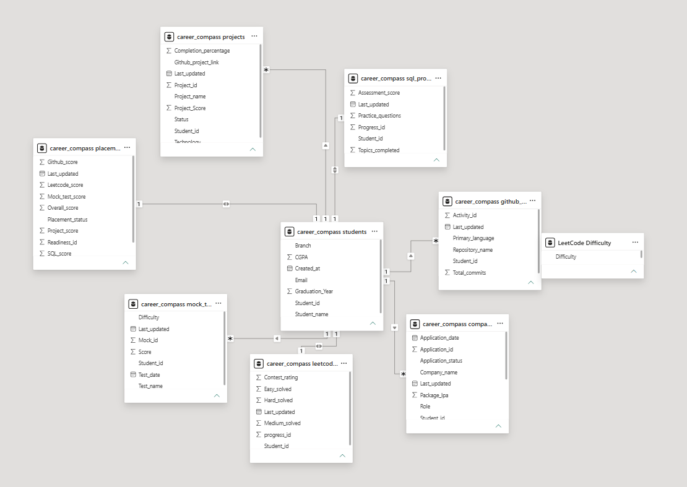
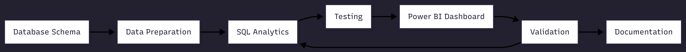

# CareerCompass SEPM Documentation

## 1. Project Overview

CareerCompass is a student placement analytics system designed to analyze academic performance, coding preparation, SQL skills, project performance, GitHub activity, mock test results, and company application outcomes.

The system uses MySQL for data storage and SQL-based analytics. Power BI is used to visualize the analytical results through six interactive dashboard pages.

The primary goal of CareerCompass is to provide a centralized analytical view of student placement preparation and identify performance trends across different technical and placement-related areas.

## 2. Problem Statement

Student placement preparation data is often distributed across multiple platforms such as coding profiles, project repositories, assessment records, and company application trackers.

This makes it difficult to evaluate a student's overall placement readiness and compare performance across different preparation areas.

CareerCompass addresses this problem by organizing placement-related data into a structured relational database and applying SQL analytics to generate meaningful placement insights.

## 3. Project Objectives

- Store student placement preparation data in a structured relational database.
- Analyze student academic, coding, SQL, project, and mock test performance.
- Evaluate placement readiness using multiple performance components.
- Analyze company applications and placement outcomes.
- Provide branch-wise and student-wise performance comparisons.
- Visualize analytical results using interactive Power BI dashboards.

## 4. SDLC Model Used

CareerCompass follows an Agile and iterative development approach.

The project was developed in multiple stages, with each stage focusing on a specific part of the system. Features and analytics were implemented, reviewed, and improved before moving to the next stage.

### Development Iterations

1. Database schema design and table creation.
2. Student placement dataset preparation.
3. Student and academic analytics.
4. LeetCode and SQL analytics.
5. Project and GitHub analytics.
6. Mock test and company application analytics.
7. Placement readiness analytics.
8. Power BI dashboard development.
9. Project documentation and repository preparation.

This iterative approach allowed the project to be developed section by section while continuously validating SQL queries, analytical results, and dashboard visuals.

## 5. Requirements Analysis

### Functional Requirements

- The system should store student academic and placement preparation data.
- The system should track LeetCode and SQL preparation progress.
- The system should store student project and GitHub activity.
- The system should maintain mock test performance records.
- The system should track company applications and application status.
- The system should calculate and store placement readiness information.
- The system should support SQL-based student and branch analytics.
- The system should provide interactive Power BI dashboards.
- The dashboard should support branch-based filtering.

### Non-Functional Requirements

- The database should maintain data consistency using primary and foreign keys.
- SQL queries should provide accurate analytical results.
- The database structure should support multiple analytical categories.
- Dashboard visuals should be simple and easy to interpret.
- The system should support future enhancements and additional analytics.
- Project files should be organized and documented for maintainability. 

## 6. System Design

CareerCompass follows a database-driven analytics architecture.

### System Flow

Student Placement Data → MySQL Database → SQL Analytics → Power BI Dashboard

### System Architecture Diagram

### Data Model Diagram

### System Modules

1. **Student Module** — Stores student details, branch, and CGPA.

2. **LeetCode Module** — Stores coding problem-solving and contest performance.

3. **SQL Module** — Stores SQL topics completed, practice activity, and assessment scores.

4. **Project Module** — Stores student project details, technologies, completion, and project scores.

5. **GitHub Module** — Stores repository activity, programming languages, and commit data.

6. **Mock Test Module** — Stores mock test scores, difficulty, and test performance.

7. **Company Application Module** — Stores company applications, roles, packages, and application status.

8. **Placement Readiness Module** — Stores readiness component scores and overall placement readiness.

### Analytics Layer

CareerCompass contains 206 SQL analytics queries organized into nine analytical sections.

The SQL analytics layer uses joins, subqueries, aggregate functions, CASE expressions, CTEs, window functions, views, ranking functions, and grouped analysis.

### Visualization Layer

Power BI is used as the visualization layer of CareerCompass.

The dashboard contains six interactive analytics pages and uses DAX measures, KPIs, charts, tables, and branch-based filtering to present placement insights.

## 7. Agile and Scrum Application

CareerCompass follows an iterative development approach inspired by Agile and Scrum practices.

The project was divided into smaller development tasks and analytics sections. Each task was completed, tested, and reviewed before continuing to the next part of the project.

### Agile Iterative Development Flow

### Sprint-Based Development

- **Sprint 1** — Database schema and student data.
- **Sprint 2** — Student, LeetCode, and SQL analytics.
- **Sprint 3** — Project and GitHub analytics.
- **Sprint 4** — Mock test and company application analytics.
- **Sprint 5** — Placement readiness analytics.
- **Sprint 6** — Power BI dashboard development.
- **Sprint 7** — Documentation and GitHub repository preparation.

### Scrum Practices Applied

- Project work was divided into smaller tasks.
- Development progress was reviewed after completing each section.
- SQL queries were tested and verified before moving forward.
- Dashboard pages were developed and reviewed individually.
- Improvements were made based on testing and analytical results.

## 8. Testing and Validation

CareerCompass was tested throughout the development process to verify database operations, SQL analytics, and dashboard results.

### Database Testing

- Verified table creation and database schema.
- Checked primary key and foreign key relationships.
- Validated inserted student and placement data.
- Verified data types and table structures.

### SQL Query Testing

- Executed analytics queries in MySQL Workbench.
- Verified aggregate results such as COUNT, AVG, MIN, MAX, and SUM.
- Tested joins between related CareerCompass tables.
- Validated subqueries and above-average comparisons.
- Tested CTE and window function queries.
- Verified ROW_NUMBER, RANK, and DENSE_RANK results.
- Tested analytical views and summary queries.

### Power BI Validation

- Compared Power BI KPI values with MySQL query results.
- Verified dashboard calculations and DAX measures.
- Tested the Branch slicer across all dashboard pages.
- Verified ranking tables and above-average analytics.
- Checked dashboard visuals against the underlying CareerCompass data.

Testing and validation were performed iteratively after each major analytics section and dashboard page.

## 9. COCOMO Estimation

The Basic COCOMO model can be used to estimate the development effort and time required for CareerCompass.

CareerCompass is classified under the **Organic Mode** because it is a relatively small software project developed with clearly defined requirements and familiar technologies.

### COCOMO Formula

Effort:

E = 2.4 × (KLOC)^1.05

Development Time:

D = 2.5 × (E)^0.38

Where:

- **E** represents development effort in person-months.
- **D** represents development time in months.
- **KLOC** represents thousands of lines of code.

### CareerCompass Estimation

Assuming CareerCompass contains approximately 3 KLOC:

- Estimated Effort = 2.4 × (3)^1.05 ≈ 7.6 person-months.
- Estimated Development Time = 2.5 × (7.6)^0.38 ≈ 5.4 months.

The COCOMO estimation provides a theoretical software engineering estimate. The actual CareerCompass development process differs because the project was developed as an individual academic and portfolio project using modern development and analytics tools.

## 10. Risk Management

Potential project risks were identified during CareerCompass development.

| Risk | Impact | Mitigation |
| --- | --- | --- |
| Incorrect SQL query results | High | SQL query outputs were manually verified in MySQL Workbench. |
| Inconsistent database data | High | Primary keys and foreign keys were used to maintain relationships. |
| Incorrect dashboard calculations | High | Power BI KPI values were compared with MySQL query results. |
| Complex analytical queries | Medium | Queries were developed and tested section by section. |
| Dashboard readability issues | Medium | Visuals were reviewed and adjusted individually. |
| Project file management | Low | Files were organized into SQL, PowerBI, Screenshots, and Docs folders. |

## 11. Future Scope

CareerCompass Version 2 is planned to extend the automation and analytical capabilities of the project.

Planned enhancements include:

- Automatic `Project_Score` evaluation using a structured project assessment rubric.
- SQL triggers for automated database operations.
- Audit logs for tracking important database changes.
- Stored procedures for reusable database operations.
- Dynamic SQL for flexible analytics.
- Admin-focused analytics dashboard.
- Enhanced project logo, branding, and visual identity.

The automatic project scoring system is planned to evaluate Technology Difficulty, Project Complexity, Industry Relevance, Completion, and Innovation or Code Quality.

## 12. Conclusion

CareerCompass demonstrates the use of relational database design, SQL analytics, and business intelligence for student placement analysis.

The project organizes multiple placement preparation areas into a structured MySQL database and uses 206 SQL analytics queries to analyze student performance, technical preparation, projects, GitHub activity, mock tests, company applications, and placement readiness.

Power BI provides an interactive visualization layer through six analytics dashboard pages.

The project also applies software engineering concepts such as iterative development, requirements analysis, modular system design, testing, risk management, Agile practices, and COCOMO estimation.

