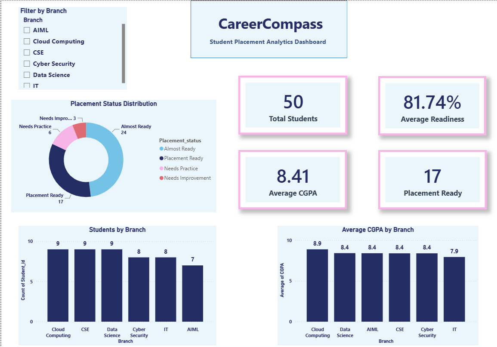
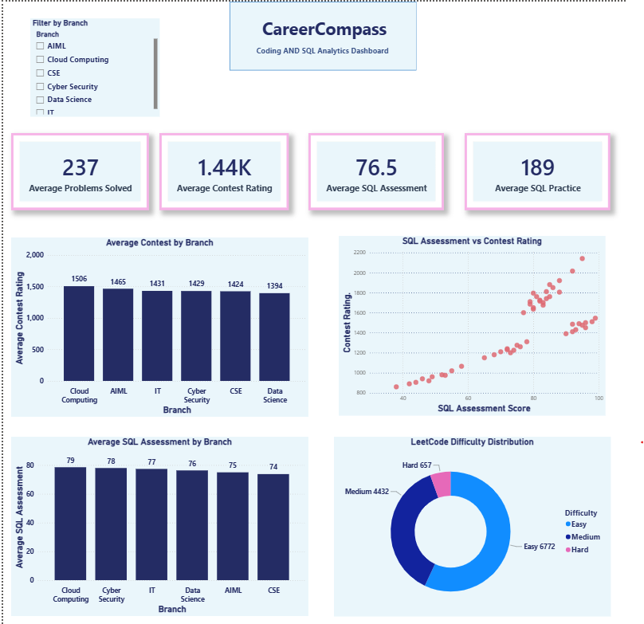
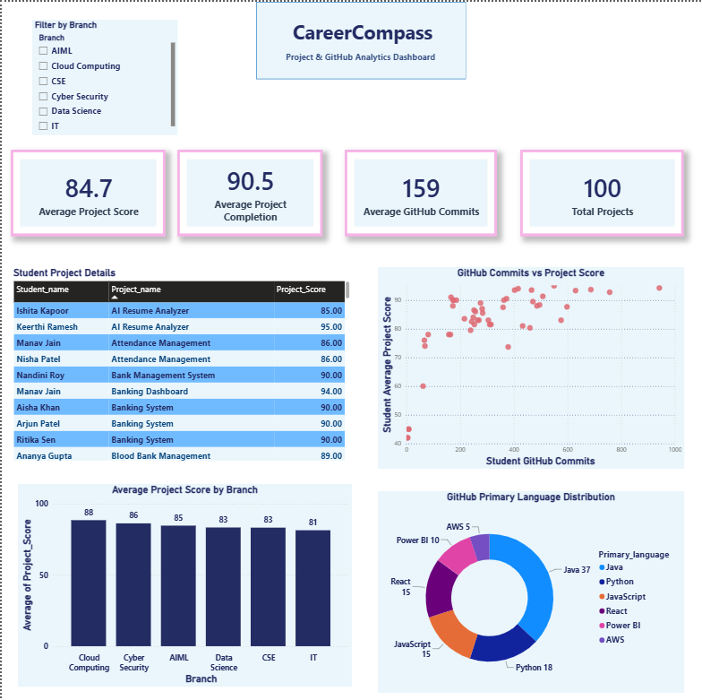
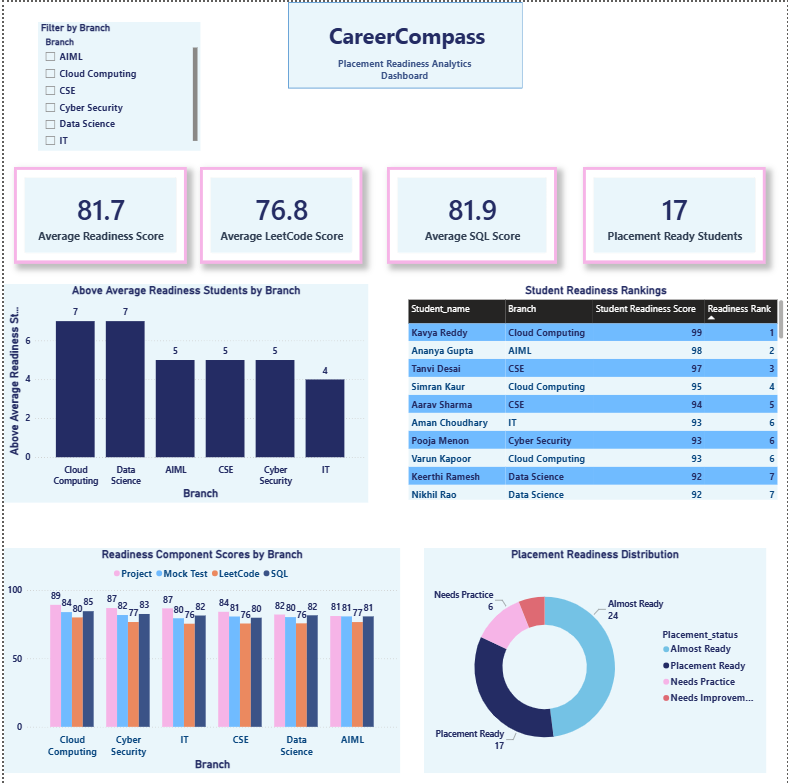
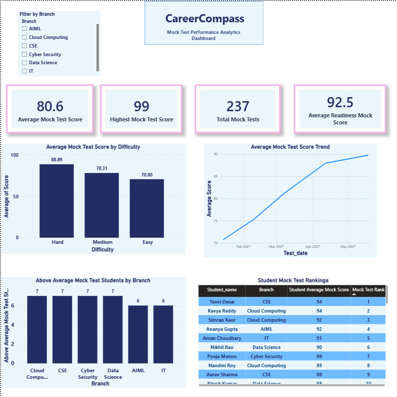
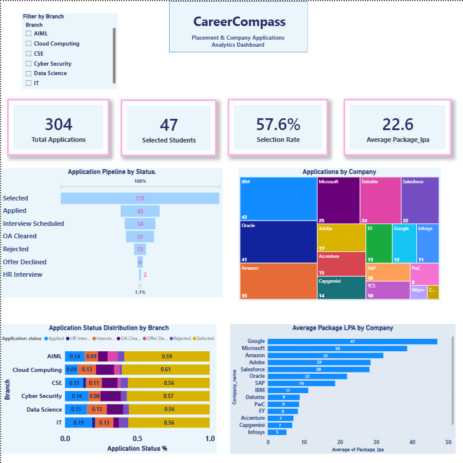

# CareerCompass

### Student Placement Analytics & Readiness Dashboard

CareerCompass is a SQL-driven student placement analytics system designed to centralize and analyze student technical preparation, project development, coding progress, and placement performance.

The system integrates data from LeetCode progress, SQL preparation, GitHub activity, projects, mock tests, placement readiness scores, and company applications into a structured MySQL database. Advanced SQL analytics are used to identify performance trends, compare student and branch performance, rank students, and evaluate placement readiness.

The analyzed data is visualized through a six-page interactive Power BI dashboard, providing a comprehensive view of student preparation and placement outcomes.

## Problem Statement

Student placement preparation data is often scattered across multiple platforms and activities such as coding practice, SQL preparation, GitHub repositories, academic records, projects, mock tests, and company applications.

This fragmented data makes it difficult to evaluate a student's overall placement readiness, compare performance across branches, identify skill gaps, and track placement outcomes.

CareerCompass addresses this problem by centralizing placement preparation data in a structured MySQL database and using SQL analytics with Power BI to transform the data into meaningful placement insights.

## Key Features

- Centralized student placement analytics database
- LeetCode difficulty-wise progress analysis
- SQL topic and performance tracking
- Student project performance analytics
- GitHub repository, commit, and programming language analysis
- Placement readiness score and status analysis
- Mock test performance and score trend analysis
- Company application and selection tracking
- Branch-wise student performance comparison
- Above-average student performance identification
- Student readiness and mock test ranking analytics
- Interactive six-page Power BI dashboard with branch filtering

## Power BI Dashboard

CareerCompass includes a six-page interactive Power BI dashboard designed to analyze different stages of student placement preparation and placement performance.

### 1. Student Overview

Provides a high-level overview of the student cohort, including student distribution, branch-level analysis, academic performance, and student demographic insights.

### 2. Coding & SQL Analytics

Analyzes LeetCode and SQL preparation progress using difficulty-wise problem-solving data, SQL performance metrics, and branch-level comparisons.

### 3. Project & GitHub Analytics

Evaluates student project performance and GitHub activity through project scores, repository analysis, commit activity, programming language distribution, and interactive student project details.

### 4. Placement Readiness Analytics

Analyzes overall placement readiness using readiness scores, placement status distribution, above-average student analysis, readiness component comparison, and student readiness rankings.

### 5. Mock Test Performance

Tracks mock test performance using difficulty-wise score analysis, score trends over time, above-average student comparisons, and student mock test rankings.

### 6. Placement & Company Analytics

Analyzes company application activity, student selections, selection rate, package information, application pipeline stages, company application concentration, branch-wise application status distribution, and company package comparisons.

## Database Schema

CareerCompass uses a relational MySQL database designed to store and connect different areas of student placement preparation.

The Version 1 database consists of the following core tables:

- `students` — Stores student academic and branch information
- `leetcode_progress` — Tracks difficulty-wise LeetCode problem-solving progress
- `sql_progress` — Stores student SQL preparation and performance data
- `projects` — Stores student project details and project scores
- `github_activity` — Tracks repositories, programming languages, and commit activity
- `mock_tests` — Stores mock test attempts, difficulty levels, dates, and scores
- `company_applications` — Tracks company applications, application status, and package information
- `placement_readiness` — Stores placement readiness component scores, overall scores, and placement status

The tables are connected using primary and foreign key relationships, allowing student performance to be analyzed across multiple preparation and placement dimensions.

## SQL Analytics & Concepts Used

CareerCompass uses SQL not only for data storage but also as the primary analytics layer of the project.

The project includes approximately 200+ SQL queries covering student, coding, SQL, project, GitHub, mock test, placement readiness, and company application analytics.

Key SQL concepts implemented include:

- Aggregate functions including `COUNT`, `SUM`, `AVG`, `MIN`, and `MAX`
- `GROUP BY` and `HAVING` for grouped analytics
- `INNER JOIN`, `LEFT JOIN`, `RIGHT JOIN`, and multi-table joins
- Subqueries and correlated subqueries
- Common Table Expressions using `WITH`
- `CASE` expressions for analytical classification and segmentation
- Window functions including `ROW_NUMBER`, `RANK`, and `DENSE_RANK`
- `PARTITION BY` for group-based ranking and analytics
- Above-average and greater-than-average performance comparisons
- Views for reusable analytical query results
- Indexes and `EXPLAIN` for query optimization analysis
- Transactions using `COMMIT` and `ROLLBACK`
- Primary keys, foreign keys, `UNIQUE`, and `NOT NULL` constraints
- Data modification using `INSERT`, `UPDATE`, and `DELETE`
- Schema modification using `ALTER TABLE`

These SQL techniques are used to identify student performance trends, compare branches, rank students, analyze project and GitHub activity, evaluate placement readiness, and study company application outcomes.

## Tech Stack

- **Database:** MySQL
- **Database Tool:** MySQL Workbench
- **Data Analytics:** SQL
- **Data Visualization:** Power BI
- **Dashboard Calculations:** DAX
- **Version Control:** Git
- **Repository Hosting:** GitHub
- **Documentation:** Markdown

## Project Structure

```text
CareerCompass/
├── Docs/
├── PowerBI/
├── Screenshots/
├── SQL/
├── LICENSE
└── README.md
```

### Folder Description

- `Docs` — Contains software engineering and project documentation
- `PowerBI` — Contains the CareerCompass Power BI dashboard file
- `Screenshots` — Stores dashboard screenshots used in project documentation
- `SQL` — Contains the CareerCompass database schema, data, and analytics queries

## Dashboard Screenshots

The CareerCompass Power BI dashboard consists of six interactive analytics pages covering student performance, technical preparation, placement readiness, mock tests, and company application outcomes.

Dashboard screenshots are available in the `Screenshots` directory.

## Setup and Usage

1. Clone the CareerCompass repository.
2. Open MySQL Workbench and create the CareerCompass database.
3. Execute the SQL schema and data scripts available in the `SQL` directory.
4. Run the analytics queries to explore student placement insights.
5. Open the CareerCompass Power BI dashboard file from the `PowerBI` directory.
6. Refresh the Power BI data connection if required.
7. Use the Branch slicer and interactive dashboard visuals to explore placement analytics.

## Version 2 Roadmap

CareerCompass Version 2 is planned to extend the analytics and automation capabilities of the system.

Planned enhancements include:

- Automatic `Project_Score` evaluation using a structured project assessment rubric
- SQL triggers for automated database operations
- Audit logs for tracking important data changes
- Stored procedures for reusable database operations
- Dynamic SQL for flexible analytical queries
- Admin-focused analytics dashboard
- Enhanced project branding and visual identity

The automatic project scoring system is planned to evaluate projects using factors such as technology difficulty, project complexity, industry relevance, completion, and innovation or code quality.

## Author

**Sahil**

B.Tech Computer Science and Engineering — Cloud Computing

SRM Institute of Science and Technology

## Dashboard Preview

### Page 1 — Student Overview



### Page 2 — Coding and SQL Analytics



### Page 3 — Project and GitHub Analytics



### Page 4 — Placement Readiness Analytics



### Page 5 — Mock Test Performance Analytics



### Page 6 — Company Application Analytics

